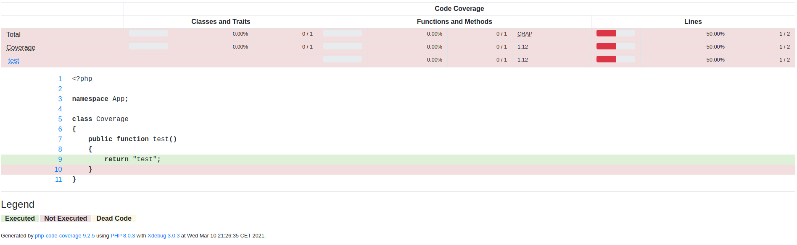

# install

versions I used:

| tool              | version     |
| -------------     | ----------- |
| PHP               | 8.0.3 (cli) |
| php-code-coverage | 9.2.5       |
| Xdebug            | 3.0.3       |
| behat             | 3.8.1       |
| phpunit           | 9.5.2       |

sample project to reproduce the issue [852](https://github.com/sebastianbergmann/php-code-coverage/issues/852)

clone the repository

install the dependencies with composer

generate the coverage report with :
```
XDEBUG_MODE=coverage bin/behat --config behat.yml
```

the result is the following one, where I would expect a 100% coverage


